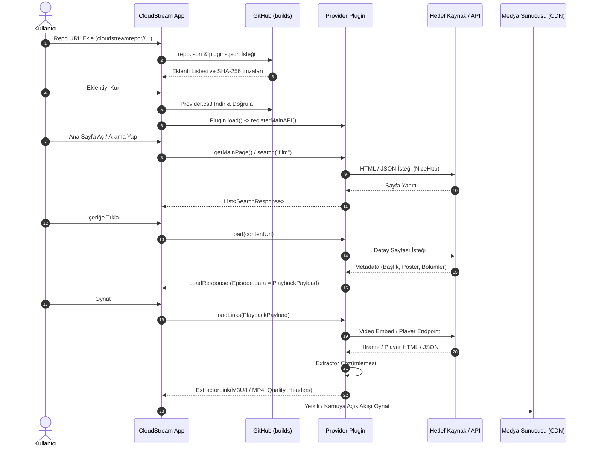

# CloudStream TR Mimari Dokümanı (Architecture)

## 1. Temel Mimarî Ayrım

CloudStream eklenti ekosisteminde üç bağımsız katman bulunur. Bu katmanların birbirine karıştırılmaması mimarinin sürdürülebilirliği ve güvenliği için esastır:

```
+-------------------------------------------------------------+
| 1. REPOSITORY DAĞITIMI (Distribution Layer)                  |
|    repo.json -> plugins.json -> *.cs3 Artifacts             |
+-------------------------------------------------------------+
                              |
                              v
+-------------------------------------------------------------+
| 2. İÇERİK META VERİSİ (Content Metadata Layer)              |
|    MainAPI: getMainPage() / search() / load()               |
|    Kararlı Tanımlayıcılar (Stable Episode Data / Payload)   |
+-------------------------------------------------------------+
                              |
                              v
+-------------------------------------------------------------+
| 3. OYNATMA ÇÖZÜMLEMESİ (Playback Resolution Layer)           |
|    loadLinks(PlaybackPayload) -> Direct Stream / Extractor  |
|    Geçici / İmzalı Medya Akışları (Ephemeral Media URLs)    |
+-------------------------------------------------------------+
```

### Katman Detayları

1. **Repository Dağıtımı (Distribution)**:
   - Kaynak kod `main` branch'inde saklanır.
   - GitHub Actions CI/CD süreci Gradle CloudStream eklentisini çalıştırarak derlenmiş `.cs3` dosyalarını ve imzalı `plugins.json` manifestini üretir.
   - Dağıtım atomik olarak `builds` branch'inde barındırılır.
   - CloudStream istemcisi yalnızca `repo.json` ve `plugins.json` dosyalarıyla konuşarak eklentiyi yükler.

2. **İçerik Meta Verisi (Content Metadata)**:
   - Eklenti, hedef platformun kamuya açık sayfalarını/API'lerini ayrıştırır (`SearchResponse`, `LoadResponse`).
   - `Episode.data` veya `LoadResponse.data` içine **asla son geçici oynatma linki yazılmaz**. Yalnızca kararlı içerik/bölüm kimliği (`PlaybackPayload`) yerleştirilir.

3. **Oynatma Çözümlemesi (Runtime Resolution)**:
   - Kullanıcı oynat tuşuna bastığında `loadLinks()` tetiklenir.
   - `PlaybackPayload` çözümlenir, embed iframe veya doğrudan medya kaynağı tespit edilir.
   - Built-in veya custom `ExtractorApi` ile son `.m3u8` veya `.mp4` akışı `callback(newExtractorLink(...))` ile CloudStream video oynatıcısına iletilir.

---

## 2. Uçtan Uca Veri Akış Diyagramı (End-to-End Pipeline)



---

## 3. Güvenlik ve Uyumluluk İlkeleri

- **Doğrudan Veritabanı Yasağı**: Git repository'si içerisinde hiçbir zaman geçici `.m3u8` veya imzalı CDN token'ı barındırılmaz.
- **Yasal ve Teknik Sınır**: DRM/Widevine bypass, CAPTCHA kırma, private credential kullanımı veya kullanıcı hesabından gizli çerez toplama kesinlikle yasaktır.
- **Domain İzolasyonu**: Domain değişiklikleri yalnızca `config/domains.json` allowlist'ine uygun olduğunda ve testleri başarıyla geçtiğinde uygulanır.
