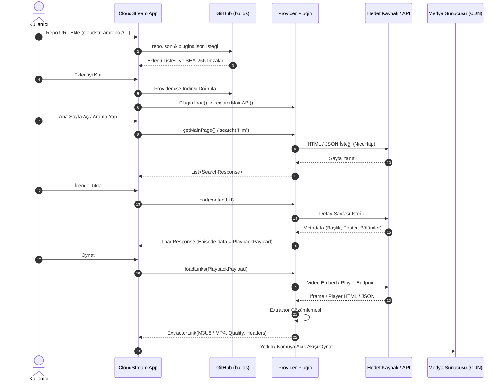

# CloudStream TR Mimari Dokümanı (Architecture)

## 1. Temel Mimarî Ayrım

CloudStream eklenti ekosisteminde üç bağımsız katman bulunur. Bu katmanların birbirine karıştırılmaması mimarinin sürdürülebilirliği ve güvenliği için esastır:

```
+-------------------------------------------------------------+
| 1. REPOSITORY DAĞITIMI (Distribution Layer)                  |
|    repo.json -> plugins.json -> *.cs3 Artifacts             |
+-------------------------------------------------------------+
                              |
                              v
+-------------------------------------------------------------+
| 2. İÇERİK META VERİSİ (Content Metadata Layer)              |
|    MainAPI: getMainPage() / search() / load()               |
|    Kararlı Tanımlayıcılar (Stable Episode Data / Payload)   |
+-------------------------------------------------------------+
                              |
                              v
+-------------------------------------------------------------+
| 3. OYNATMA ÇÖZÜMLEMESİ (Playback Resolution Layer)           |
|    loadLinks(PlaybackPayload) -> Direct Stream / Extractor  |
|    Geçici / İmzalı Medya Akışları (Ephemeral Media URLs)    |
+-------------------------------------------------------------+
```

### Katman Detayları

1. **Repository Dağıtımı (Distribution)**:
   - Kaynak kod `main` branch'inde saklanır.
   - GitHub Actions CI/CD süreci Gradle CloudStream eklentisini çalıştırarak derlenmiş `.cs3` dosyalarını ve imzalı `plugins.json` manifestini üretir.
   - Dağıtım atomik olarak `builds` branch'inde barındırılır.
   - CloudStream istemcisi yalnızca `repo.json` ve `plugins.json` dosyalarıyla konuşarak eklentiyi yükler.

2. **İçerik Meta Verisi (Content Metadata)**:
   - Eklenti, hedef platformun kamuya açık sayfalarını/API'lerini ayrıştırır (`SearchResponse`, `LoadResponse`).
   - `Episode.data` veya `LoadResponse.data` içine **asla son geçici oynatma linki yazılmaz**. Yalnızca kararlı içerik/bölüm kimliği (`PlaybackPayload`) yerleştirilir.

3. **Oynatma Çözümlemesi (Runtime Resolution)**:
   - Kullanıcı oynat tuşuna bastığında `loadLinks()` tetiklenir.
   - `PlaybackPayload` çözümlenir, embed iframe veya doğrudan medya kaynağı tespit edilir.
   - Built-in veya custom `ExtractorApi` ile son `.m3u8` veya `.mp4` akışı `callback(newExtractorLink(...))` ile CloudStream video oynatıcısına iletilir.

---

## 2. Uçtan Uca Veri Akış Diyagramı (End-to-End Pipeline)



---

## 3. Güvenlik ve Uyumluluk İlkeleri

- **Doğrudan Veritabanı Yasağı**: Git repository'si içerisinde hiçbir zaman geçici `.m3u8` veya imzalı CDN token'ı barındırılmaz.
- **Yasal ve Teknik Sınır**: DRM/Widevine bypass, CAPTCHA kırma, private credential kullanımı veya kullanıcı hesabından gizli çerez toplama kesinlikle yasaktır.
- **Domain İzolasyonu**: Domain değişiklikleri yalnızca `config/domains.json` allowlist'ine uygun olduğunda ve testleri başarıyla geçtiğinde uygulanır.

---

## 4. Medya Doğrulama ve Ön Kontrol Katmanı (StreamValidator)

Kullanıcılarda görülen `ERROR_CODE_PARSING_CONTAINER_UNSUPPORTED (3003)` hatalarını önlemek amacıyla `core` modülünde `StreamValidator` preflight mimarisi kurulmuştur:

- **Hafif & Sınırlı Zaman Aşımlı Kontrol**: `ExtractorLink` emit edilmeden önce maksimum 2 saniyelik zaman aşımı ile ilk byte aralığı (`Range: bytes=0-1024`) veya `HEAD` isteği yapılır.
- **Magic Byte Analizi**:
  - HLS akışları için `#EXTM3U` başlığı doğrulanır ve `ExtractorLinkType.M3U8` olarak işaretlenir.
  - MP4 için `ftyp`/`moov` atomları taranır ve `ExtractorLinkType.VIDEO` atanır.
  - MKV/WebM için `EBML` (`0x1A 0x45 0xDF 0xA3`) imzası doğrulanır.
- **Hata Sayfası Eleme (3003 Önleme)**: `text/html`, Cloudflare challenge sayfaları, "security error" veya JSON hata yanıtları oyuncuya gitmeden elenir.

---

## 5. Sağlayıcı Federasyon ve Güvenli Eşleştirme (CloudStreamHub Super-Plugin)

CloudStreamHub, bağımsız eklentilerle şu prensiplerle federasyon kurar:

- **İzole Reflection Adapter (`CloudStreamProviderRegistryAdapter`)**: `APIHolder` üzerindeki kayıtlı sağlayıcıları dinamik olarak sorgular. Hardcoded sağlayıcı listelerine veya izole classloader'lar arası riskli sınıf yüklemelerine dayanmaz.
- **Katı Eşleştirme Motoru (`HubMatchingEngine`)**:
  - Normalized Title + Year (veya $\ge 0.85$ benzerlik skoru + yıl) eşleşmesi aranır.
  - Güven eşiği aşılmadığında ilk sonuca (`searchList.first()`) fallback YAPILMAZ; yanlış film oynatılması engellenir.
  - Dizi bölümlerinde sezon numarası birebir tutmuyorsa kesinlikle başka sezona fallback yapılmaz.

---

## 6. Sağlık İzleme Modeli (L0 - L8)

- **L0 Config**: Modül, build.gradle.kts ve domain konfigürasyonu doğrulaması.
- **L1 Domain**: DNS/HTTPS, redirect allowlist ve içerik bütünlüğü marker'ı.
- **L2 Homepage**: Dinamik DOM ayrıştırma ve CSS seçici drift denetimi.
- **L3 Search**: Arama API / form doğrulaması.
- **L4 Load**: Detay sayfası ve soft-404 tespiti.
- **L5 Player Discovery**: Video container ve iframe tespiti.
- **L6 Extractor Resolution**: Embed URL'inin başarıyla medya linkine çözümlenmesi.
- **L7 Media Preflight**: Stream URL'inin HTTP durum, Content-Type ve magic byte geçerliliği.
- **L8 First Segment**: HLS manifestinden ilk medya segmentinin indirilip doğrulanması.
