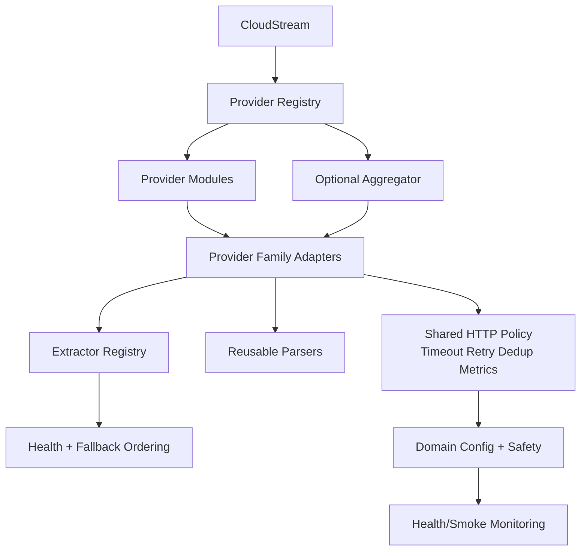

# FINAL_REPORT — CloudStream Repo Competitive R&D Synthesis

## 1. Executive Summary

Araştırmanın ana sonucu: **Bizim Repo'nun en güçlü tarafı güvenli domain/runtime-resolution/distribution temeli; en büyük açığı ise provider coverage ve reusable multi-provider orchestration katmanı.** Rakiplerde görülen en değerli fikirler üç kümeye ayrılıyor:

1. **Coverage + provider families:** WioSinema, TurkSinema, Ripplay, akin-cloudstream, Anthology.
2. **Health/fallback/observability:** TurkSpor, WioSpor, BitChord, SkyStream.
3. **Client/runtime architecture:** SkyStream, VibeFlow, MetroVerse, ViTune/NexMusic.

En güçlü kısa vadeli strateji, Bizim Repo'yu yeniden yazmak değil; mevcut güvenli yapıya **shared provider-family abstraction, bounded concurrency, health-based source ordering, request dedup/cache ve yeni provider POC'ları** eklemek.

## 2. Repository Ranking

| Sıra | Repo | AR-GE Değeri | Teknik Kalite/Önem | Bizimle Benzerlik | İncelenmeli mi? |
|---|---|---:|---|---|---|
| 1 | Emre-Kahveci/CloudStreamHub | 10 | Kritik | Çok yüksek | Evet |
| 2 | Wiojelt/WioSinema | 9.7 | Kritik | Yüksek | Evet |
| 3 | akashdh11/skystream | 9.6 | Kritik | Yüksek | Evet |
| 4 | Wiojelt/TurkSinema | 9.5 | Kritik | Yüksek | Evet |
| 5 | Wiojelt/TurkSpor | 9.3 | Kritik | Yüksek | Evet |
| 6 | falsisdev/anthology | 9.2 | Kritik | Yüksek | Evet |
| 7 | Ripplay/cloudstream-repo | 9.0 | Kritik | Yüksek | Evet |
| 8 | PrabinCode/VibeFlow | 8.8 | Yüksek | Yüksek | Evet |
| 9 | Wiojelt/WioSpor | 8.7 | Yüksek | Yüksek | Evet |
| 10 | neoser1984/cloudstream-extensions | 8.5 | Yüksek | Yüksek | Evet |
| 11 | bartoostveen/ViTune | 8.4 | Yüksek | Yüksek | Evet |
| 12 | LUC4N3X/Levyra-deepsound | 8.3 | Yüksek | Yüksek | Evet |
| 13 | nexerisltd/NexMusic-Android | 8.2 | Yüksek | Yüksek | Evet |
| 14 | kushagrasinghx/BitChord | 8.1 | Yüksek | Yüksek | Evet |
| 15 | kaankirsan/akin-cloudstream | 8.1 | Yüksek | Yüksek | Evet |
| 16 | Sakayorii/sakayori-music | 8.0 | Yüksek | Yüksek | Evet |
| 17 | RizkLee/MetroVerse | 8.0 | Yüksek | Yüksek | Evet |
| 18 | afkcodes/sunoh | 7.8 | Orta | Orta | Evet |
| 19 | manitux-app/cs-plugins | 7.8 | Yüksek | Orta | Evet |
| 20 | MRTDEVM/cloudstream-turkce | 7.8 | Yüksek | Orta | Evet |
| 21 | N-Zik-Group/N-Zik | 7.4 | Orta | Orta | Seçici |
| 22 | SFG5453/Orchard | 7.0 | Orta | Orta | Seçici |
| 23 | mohsinapex/ApexTunes | 6.9 | Orta | Orta | Seçici |
| 24 | vivizzz007/vivi-music | 6.8 | Orta | Orta | Seçici |
| 25 | Lelonio/Square | 6.8 | Orta | Orta | Seçici |
| 26 | blackhope01/cloudstream-plugins | 6.7 | Orta | Orta | Seçici |
| 27 | josprox/Estrella-Music | 6.5 | Orta | Orta | Seçici |
| 28 | pltmustafa/plt-stream | 5.8 | Orta | Düşük | Seçici |
| 29 | GamerX3560/GamerX-Music | 4.5 | Düşük | Düşük | Seçici |
| 30 | PandaSL2/NexBeat | 3.5 | Düşük | Düşük | Seçici |
| 31 | ctnkyaumt/cstest | 3.5 | Düşük | Düşük | Seçici |
| 32 | anisector/Anz | 3.0 | Düşük | Düşük | Seçici |
| 33 | Saloo1575/SalooRepo | 2.0 | Düşük | Düşük | Seçici |

## 3. En Değerli Repositoryler

### Top 5
1. **Emre-Kahveci/CloudStreamHub** — 10/10
2. **Wiojelt/WioSinema** — 9.7/10
3. **akashdh11/skystream** — 9.6/10
4. **Wiojelt/TurkSinema** — 9.5/10
5. **Wiojelt/TurkSpor** — 9.3/10

### Top 10
1. **Emre-Kahveci/CloudStreamHub** — 10/10
2. **Wiojelt/WioSinema** — 9.7/10
3. **akashdh11/skystream** — 9.6/10
4. **Wiojelt/TurkSinema** — 9.5/10
5. **Wiojelt/TurkSpor** — 9.3/10
6. **falsisdev/anthology** — 9.2/10
7. **Ripplay/cloudstream-repo** — 9.0/10
8. **PrabinCode/VibeFlow** — 8.8/10
9. **Wiojelt/WioSpor** — 8.7/10
10. **neoser1984/cloudstream-extensions** — 8.5/10

## 4. Yeni Site / Provider Fırsatları

Öncelikli yeni provider adayları: **FullHDFilmizlesene, DiziYou, DiziBox, DDizi, DiziMom, Sinewix, FilmModu, JetFilmIzle, YabanciDizi, CizgiMax**, ayrıca spor/canlı içerik stratejik olarak ayrı ürün kararı gerektirir. Ayrıntılı duplicate-cleaned liste `SITE_PROVIDER_MATRIX.md` dosyasındadır.

## 5. Mimari Fırsatlar

- **ProviderFamily/BaseProvider:** aynı CMS/player ailesindeki sitelerin parser ve extractor kodunu paylaşması.
- **Bounded parallel resolver:** çoklu kaynağı paralel fakat cihazı/hostu boğmadan çözme.
- **Health-scored fallback:** son başarı/latency verisiyle provider sıralama.
- **Central HTTP policy:** timeout, retry, connection reuse, dedup, metrics.
- **Observability manifest:** provider search/load/loadLinks aşamalarının süre ve hata kodlarını standardize etme.
- **Catalog/resolver separation:** discovery metadata ile playback çözümlemeyi ayrı evolve etme.

## 6. Performans Analizi

### Networking
Connection reuse, dedup ve timeout budget P0 değerindedir.

### Parsing
API-first yaklaşım mümkünse HTML parse'dan daha az kırılgandır; CMS family parserları paylaştırılmalıdır.

### Extraction
Fallback chain'e health/latency ordering eklenmeli; direct stream varsa configurable early-exit test edilmelidir.

### Search
Multi-provider concurrent search için `Semaphore`/bounded dispatcher benzeri sınırlandırma ve result dedup gerekir.

### Caching
Yalnız metadata cache; signed/ephemeral stream URL'lerde expiry-aware yaklaşım.

### Startup / Runtime / Memory
CloudStream plugin repo bağlamında gerçek cihaz benchmarkı zorunludur. WioSinema TV Box modu hipotez olarak bounded concurrency ve memory guard gerekliliğini destekliyor.

## 7. En İyi Implementasyonlar

| Problem | En İyi Repo | Yaklaşım | Neden İyi? | Bizde Kullanılabilir mi? |
|---|---|---|---|---|
| Geniş film/dizi coverage | WioSinema | unified aggregator | Çok sayıda kaynak tek UX | Evet, incremental |
| Provider isolation | TurkSinema | provider-per-package | Arıza blast-radius düşük | Evet |
| Shared same-engine sites | Ripplay | OwnedSites grouping | Duplication düşürür | Evet, dikkatli |
| Sports source health | TurkSpor | provider-level health/domain registry | Dinamik kaynaklara uygun | Evet |
| Cross-platform extension runtime | SkyStream | JS extension engine | Platform taşınabilirliği | Uzun vadeli R&D |
| Client service modularity | MetroVerse/VibeFlow | service modules/core adapters | Bağımlılık izolasyonu | Konsept olarak |

## 8. Bizim Repo'nun Eksikleri

### Architecture
Reusable provider-family abstraction ve central HTTP policy eksik/kanıtlanmamış.

### Performance
Request dedup, bounded multi-provider concurrency, health-based ordering için merkezi mekanizma yok.

### Provider coverage
8 aktif provider rakip geniş repolara göre az.

### Extractor coverage
Sinewix, DiziBox/DiziMom, CizgiMax ve çeşitli player family'leri eksik.

### Reliability
Domain safety güçlü; runtime source health telemetry geliştirilebilir.

### Maintainability
Provider family duplication azaltılabilir.

### Developer Experience
Provider generator/template + contract test fixture eklenebilir.

### Testing
Smoke metadata güçlü; gerçek fixture-based parser tests ve recorded HTTP contracts genişletilmeli.

### Observability
Build/monitoring var; provider runtime latency/error ölçümleri standardize değil.

## 9. AR-GE Backlog

Bkz. `RD_BACKLOG.md`.

## 10. Quick Wins

1. FullHDFilmizlesene ve DiziYou POC.
2. Provider matrix'i config'ten otomatik generate etme.
3. Shared HTTP timeout/retry/dedup wrapper.
4. Provider health score metadata alanları.
5. Duplicate search result normalization.

## 11. Strategic Improvements

- WioSinema tarzı aggregation'i doğrudan kopyalamak yerine `AggregatorProvider` POC.
- SkyStream JS runtime yalnız ayrı R&D branch'inde değerlendirilmelidir.
- Provider family abstraction, tek siteye özgü special-case'lerin override edilebildiği composition-first tasarımla kurulmalı.

## 12. Benchmark Önerileri

| Benchmark | Ölçüm | Karşılaştırma | Başarı Kriteri |
|---|---|---|---|
| Provider search latency | p50/p95 + request count | sequential vs bounded parallel | p95 düşüş, hata artışı yok |
| Extractor resolution | p50/p95 + timeout rate | mevcut vs health-ordered | p95 ve timeout düşüş |
| Request dedup | duplicate request count | on/off | aynı URL isteklerinde >=50% azalma |
| Metadata cache | hit ratio + stale error | TTL variants | >=30% hit, stale regression yok |
| Memory | peak RSS / Android profiler | concurrency caps | OOM yok, peak kontrollü |
| Cold start | plugin load duration | baseline vs added abstractions | <=10% regression |

## 13. Önerilen Yeni Mimari

Bu target incremental uygulanabilir; mevcut provider contractlarının yeniden yazılması gerekmez.

## 14. 30 / 60 / 90 Günlük Teknik Yol Haritası

### İlk 30 Gün
- RD-001..005.
- FullHDFilmizlesene/DiziYou POC.
- Benchmark harness başlangıcı.
- HTTP policy wrapper.

### 31–60 Gün
- ProviderFamily abstraction.
- Health-scored resolver.
- Search dedup/normalization.
- Fixture/contract tests.

### 61–90 Gün
- AggregatorProvider POC.
- TMDB-ID direct resolver feasibility.
- SkyStream JS extension runtime spike sadece araştırma branch'inde.
- Benchmark sonuçlarına göre cache/concurrency tuning.

## Son Karar

En yüksek getirili yön: **"daha fazla provider" + "daha az duplicate code" + "ölçülebilir resolver reliability"** üçlüsüdür. Bizim Repo'nun domain güvenliği ve runtime link-resolution ilkeleri korunmalı; rakiplerin daha agresif coverage ve aggregation teknikleri bu güvenlik sınırları içinde adapte edilmelidir.
